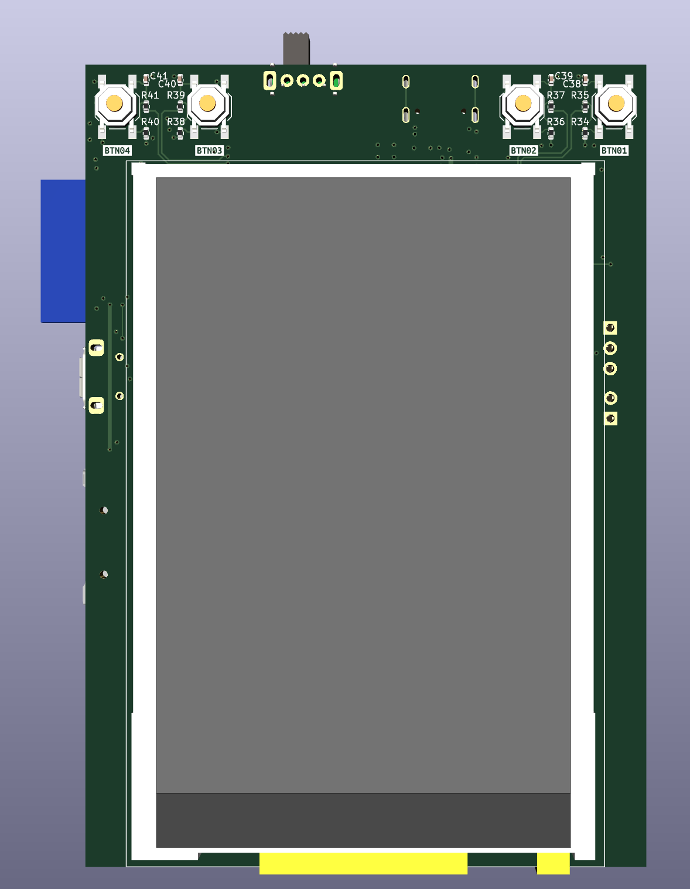
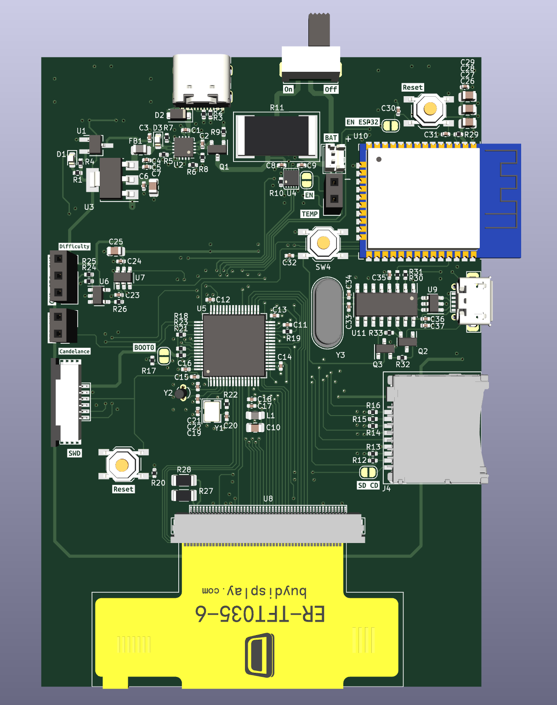

# indoor-bike-computer

- [indoor-bike-computer](#indoor-bike-computer)
	- [Description](#description)
	- [Sensors](#sensors)
		- [Candelance sensor](#candelance-sensor)
		- [Difficulty sensor](#difficulty-sensor)
	- [Firmware](#firmware)
	- [Images](#images)
		- [Computer 3D render, Front](#computer-3d-render-front)
		- [Computer 3D render, Back](#computer-3d-render-back)

## Description

It's a custom computer for indoor bikes to measure cadence, speed and power, store sessions, visualise ongoing statistics and replace non chargeable solutions. This project is created for the [Joroto X2 Pro](https://jorotofitness.com/products/joroto-x2pro-bluetooth-stationary-exercise-bike) indoor bike, but can be used with any other, similarly operating bikes as well!

The sensors connect to the unit the following way:

There are 2 sensor headers on the computer, one for the Candelance sensor and the other to measure the manual difficulty adjustment knob.

## Sensors

### Candelance sensor

You need to connect the following 2 pins:

- Revolution signal: This signal sends a pulse whenever the bike's crank is aligned with the sensor. The signal is triggered once every revolution and the speed is calculated based on the time difference between two pulse. For precise distance measurement, you can change the default values of the bike in the settings.
- GND: This is the shared GND line

### Difficulty sensor

You need to connect the following 3 pins:

- +3V3: This powers the sensor on the bike
- Difficulty signal: This comes from the knob, and depending on the current difficulty level, it provides a voltage between GND and +3V3 volt. (it's not a linear value and there is a starting and ending voltage level) This can be calibrated in the settings on the computer for a precise measurement.
- GND: This is the shared GND line

## Firmware

I'm using [LVGL](https://lvgl.io/) an open source embedded graphics library, to handle the UI elements for the computer. The drivers for the various chips and the bike are custom made and can be located under the `Firmware/STM32F446/Core/Inc/Drivers` and `Firmware/STM32F446/Core/Src/Drivers` folders.

List of drivers:

- ER_TFT035: Display driver. [Details](https://www.buydisplay.com/serial-spi-3-5-inch-tft-lcd-module-in-320x480-optl-touchscreen-ili9488)
- MCP3421: ADC chip from MicroChip. [Details](https://www.microchip.com/en-us/product/mcp3421)
- SD card: SD card middleware on top of the FatFS implementation, to make handling file read and write simpler

## Images

### Computer 3D render, Front

### Computer 3D render, Back
